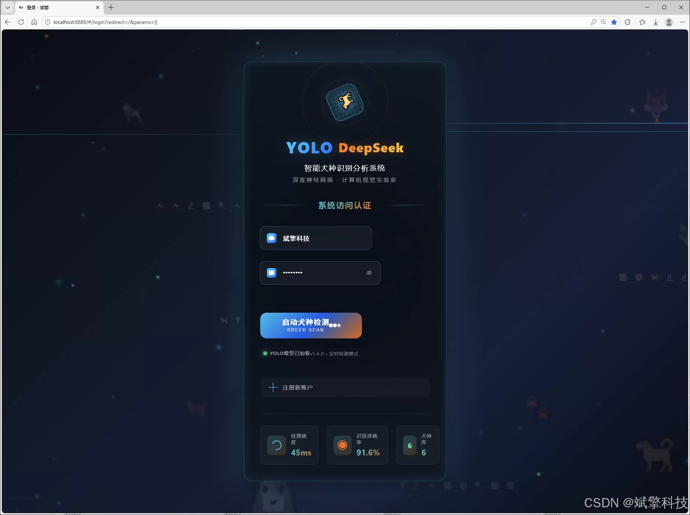
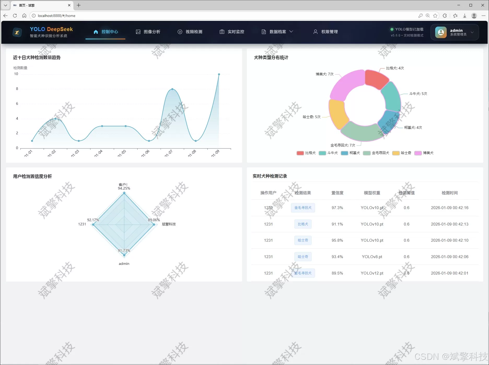
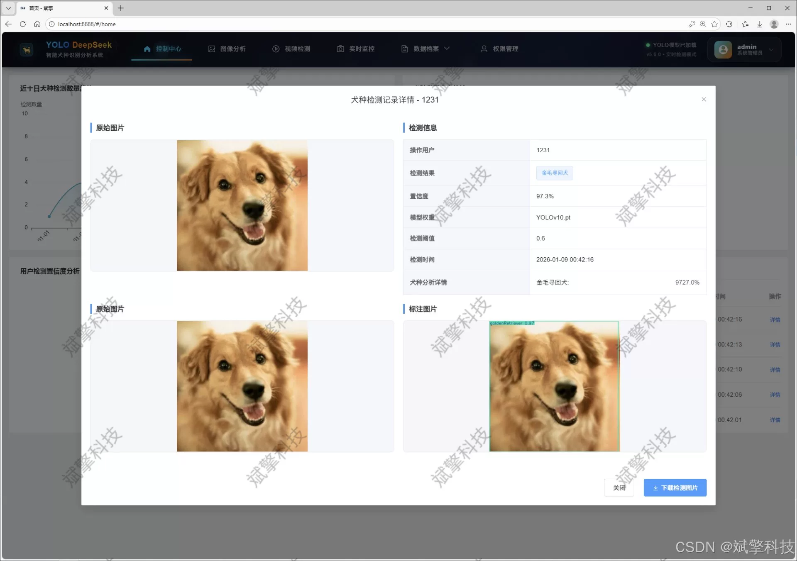
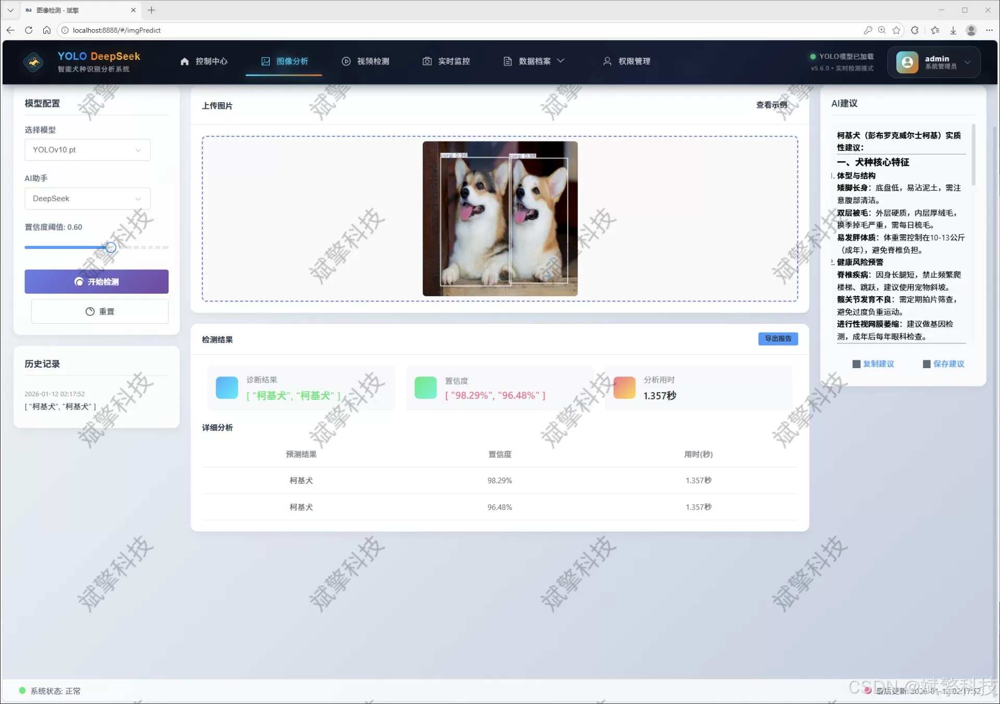
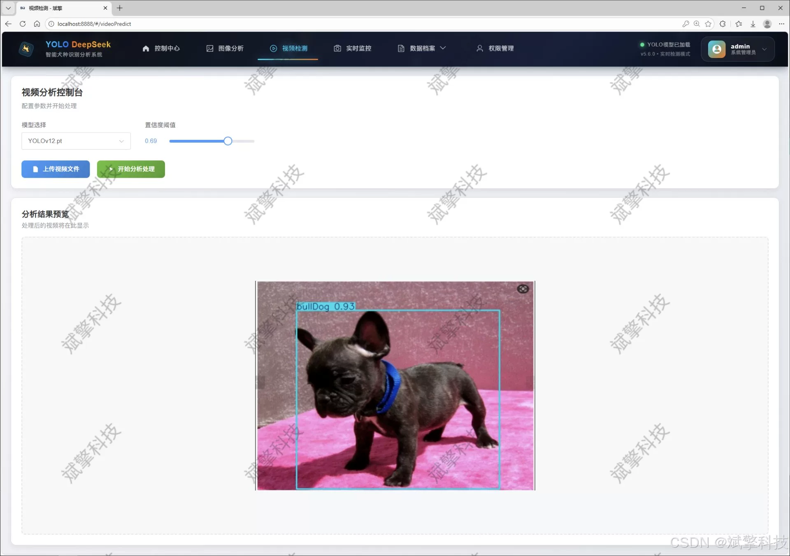
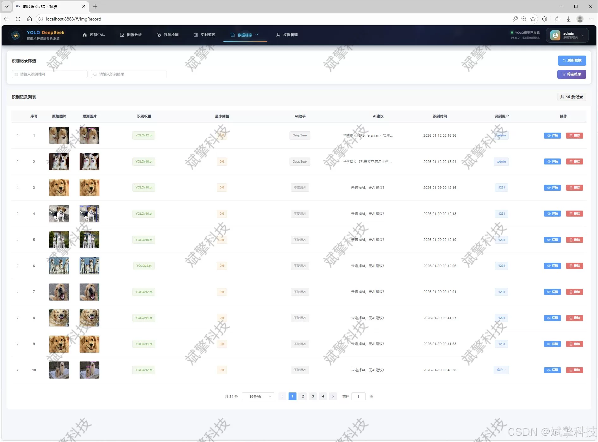
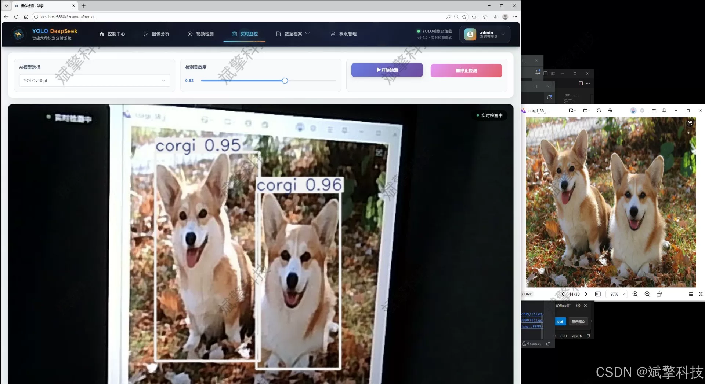
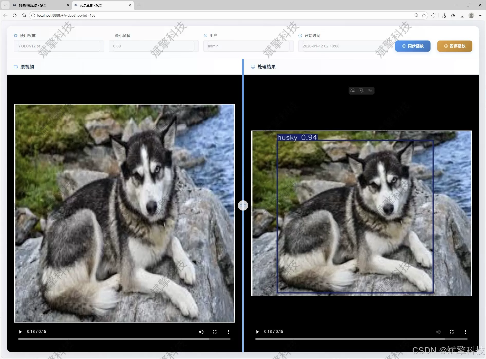
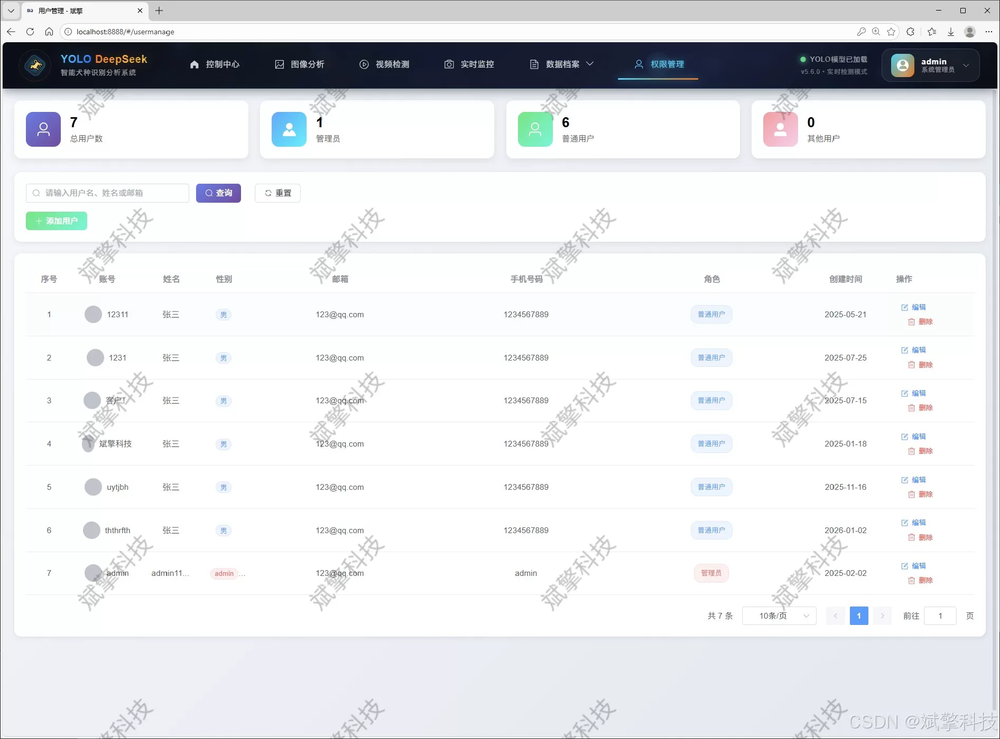

# YOLO Dog Breed Detection

## Body

YOLO dog breed detection system based on YOLO deep learning and big models like Qianwen and DeepSeek for dog breed recognition detection (DeepSeek intelligent analysis + web interface + front-end and back-end separation + YOLO data + YOLOv8/YOLOv10/YOLOv11/YOLOv12)

The core system adopts the current mainstream and advanced YOLO series object detection algorithm, integrating multiple versions of models such as YOLOv8, YOLOv10, YOLOv11, and YOLOv12. Users can flexibly switch between different versions based on their actual scene requirements for accuracy and speed. The system's backend is built using a SpringBoot framework, adopting a modern architecture with a separation between frontend and backend. The frontend provides a friendly Web interaction interface, while the database uses MySQL for structured data persistence.

The system has achieved precise identification of six common dog breeds (Beagle, Bulldog, Chihuahua, Golden Retriever, Husky, and Pomeranian). The training dataset consists of a total of 1257 labeled images (880 for the training set, 251 for the validation set, and 126 for the test set). In addition to basic image, video, and camera real-time detection capabilities, the core innovation of this system lies in its deep integration of AI analysis capabilities from DeepSeek large language model. It can provide intelligent text descriptions such as breed characteristics and pet care suggestions for the detection results, greatly enriching the output value of the system.

The system is fully functional, covering user login and registration, multimodal detection record management (images, videos, real-time streams), comprehensive data visualization, administrators' ability to add, delete, modify, and query user and recognition records (CRUD), as well as personal center information maintenance for users. This system is not only a high-precision dog breed identification tool but also an integrated service platform that combines data management, intelligent analysis, and user interaction, providing powerful solutions for the intelligentization of the pet industry, community pet management, and visual technology teaching practice.

Functional module

✅ User Login and Registration: Supports password detection, saves to MySQL database.

✅ Supports four YOLO model switches, YOLOv8, YOLOv10, YOLOv11, YOLOv12.

✅ Information Visualization, Data Visualization.

✅ Image detection supports AI analysis functions, deepseek and Qianwen.

✅ Supports image detection, video detection, and real-time camera detection. The results are saved to a MySQL database.

✅ Picture recognition record management, video recognition record management and camera recognition record management.

✅ User Management Module, administrators can add, delete, modify, and query users.

✅ Personal center, can modify their own information, password name profile picture and so on.

There is no Lunwen writing service, nor any Lunwen.

## Images

## Payment

Here is a pay link on Stripe ( https://buy.stripe.com/3cs8yP7sY87d0vu9AB ). Please contact me lonlonago@foxmail.com after funding $89, and I will send you a complete data files , thank you!

